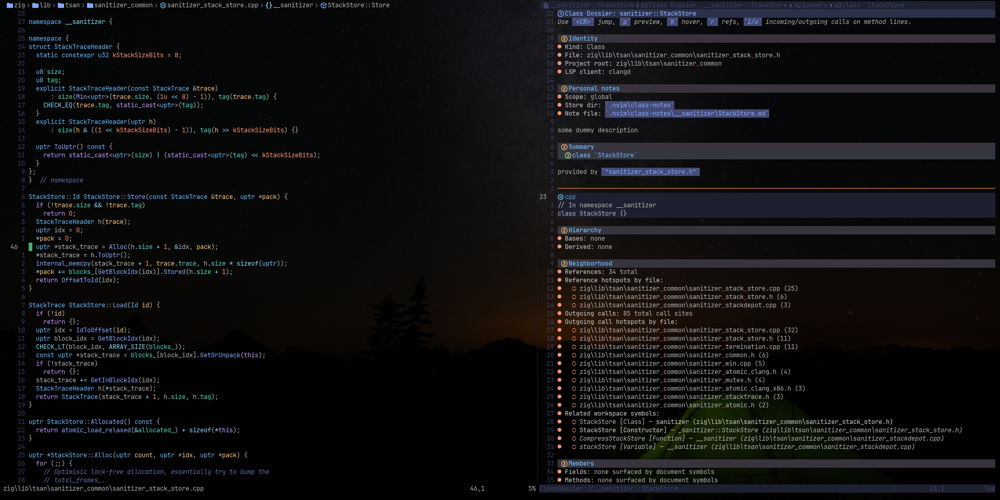

# ClassDossier.nvim

ClassDossier.nvim opens a navigable overview card for the current class or symbol and shows how it fits into the rest of the codebase.

It is built for large codebases where opening a file is not enough and you need quick answers to questions like:

- What class am I looking at?
- Where is it used?
- What does it inherit from?
- What files does it call into most?
- What methods and fields does it expose?
- What notes have I written about it before?

The plugin collects that information from your LSP and renders it in a dedicated dossier buffer that you can jump around from.

## Features

- Quick dossier view for the current file's main class or symbol
- Fallback to the symbol under the cursor if main-class detection fails
- Hover summary for the class or symbol
- Type hierarchy view:
  - base classes
  - derived classes
- Incoming reference hotspots grouped by file
- Outgoing call hotspots grouped by file
- Related workspace symbols
- Member list:
  - fields
  - methods
- Personal markdown notes per class
- Jump, preview, hover, references, incoming calls, and outgoing calls directly from the dossier
- Reuses the existing dossier buffer when reopened

## Requirements

- Neovim with built-in LSP
- An attached LSP server with good symbol support

The plugin gets the initial target from `get_main_class()`. If that fails, it falls back to the symbol under the cursor.

For the best results, your LSP should support as many of these as possible:

- `textDocument/documentSymbol`
- `workspace/symbol`
- `textDocument/hover`
- `textDocument/references`
- `textDocument/prepareTypeHierarchy`
- `typeHierarchy/supertypes`
- `typeHierarchy/subtypes`
- `textDocument/prepareCallHierarchy`
- `callHierarchy/incomingCalls`
- `callHierarchy/outgoingCalls`

`clangd` is the main intended target.

## Installation

### lazy.nvim

```lua
{
  "zadirion/ClassDossier.nvim",
  config = function()
    require("class_dossier").setup()
  end,
}
```

### packer.nvim

```lua
use {
  "zadirion/ClassDossier.nvim",
  config = function()
    require("class_dossier").setup()
  end,
}
```

## Setup

Default configuration:

```lua
require("class_dossier").setup({
  width = 64,
  side = "right", -- "right" | "left"
  timeout_ms = 700,
  max_hover_lines = 18,
  max_ref_files = 10,
  max_related_symbols = 12,
  max_methods = 18,
  max_fields = 18,
  notes_scope = "global", -- "project" | "global"
  notes_relpath = ".nvim/class-notes",
  notes_global_path = nil, -- defaults to ~/.nvim/class-notes
  prefer_client = "clangd",
})
```

## Commands

### `:ClassDossier`
Open the dossier for the current file's main class.

If main-class detection fails, the plugin falls back to the symbol under the cursor.

### `:ClassNoteEdit`
Open or create the markdown note for the current dossier target.

### `:ClassDossierNotesScope {project|global}`
Switch note storage between project-local notes and global notes.

## Dossier contents

A dossier can include:

- identity information
- personal notes
- hover summary
- type hierarchy
- incoming reference count and per-file hotspots
- outgoing call-site hotspots by file
- related workspace symbols
- fields
- methods

## Keymaps inside the dossier

These mappings are local to the dossier buffer:

- `q` — close dossier
- `<CR>` — jump to the selected location
- `p` — preview the selected location
- `K` — hover on the selected symbol
- `r` — show references for the selected symbol
- `i` — show incoming calls for the selected method
- `o` — show outgoing calls for the selected method

`i` and `o` only make sense on method lines.

## Notes

Each class can have an associated markdown note.

Notes can be stored either:

- globally, under `~/.nvim/class-notes` by default
- per project, under `.nvim/class-notes` inside the project root

The note path is derived from the fully qualified class name, so nested namespaces/classes become nested folders.

## How symbol resolution works

The plugin tries to find the best class target in this order:

1. Ask `get_main_class()` for the file's main class
2. Resolve that class through `workspace/symbol`
3. If that fails, inspect the current buffer's document symbols
4. Fall back to the symbol under the cursor

This makes the plugin usable even in files where a strict “main class” is not obvious.

## Outgoing hotspots

Outgoing hotspots are counted by call site, not just by distinct callee.

That means if methods in the current class call into the same target file multiple times, that file's count goes up for each call site. This makes the outgoing section behave like a real hotspot view rather than a simple dependency list.

## Intended workflow

A typical workflow looks like this:

1. Open a source file
2. Run `:ClassDossier`
3. Scan the summary, hierarchy, incoming references, and outgoing hotspots
4. Jump into member methods or related symbols
5. Add notes with `:ClassNoteEdit`

## Limitations

- Results are only as good as your LSP index
- Type hierarchy and call hierarchy depend on server support
- Large projects may need correct compile commands and background indexing for the best results
- The plugin is most useful with C++/clangd-style symbol-rich projects, though it can work with other languages if the LSP support is good enough

## Example

```lua
vim.keymap.set("n", "<leader>cd", function()
  require("class_dossier").open()
end, { desc = "Open Class Dossier" })
```

## Why this plugin exists

When working in a large codebase, opening a class file rarely tells the whole story. ClassDossier is meant to give you a compact, navigable briefing so you can understand a class's role in the surrounding system without manually stitching that context together every time.
